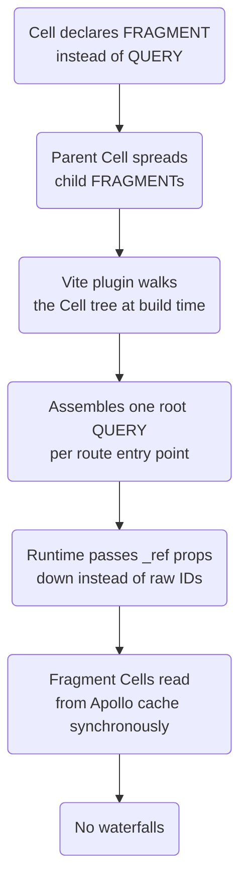

## User

Please outline what query aggregation would look like in Cedar. Don't go too
deep, just give me an overview please with some practical examples of what it
would look like in a Cedar app

## Assistant

## Query Aggregation in Cedar: Overview

The core shift: **Cells stop owning their fetches**. Instead, they declare data
requirements (like Relay fragments), and a root orchestrator assembles and fires
a single query.

### What Changes for the Developer

Today you write a Cell like this:

```tsx
// AuthorCell.tsx
export const QUERY = gql`
  query FindAuthorQuery($id: String!) {
    author: user(id: $id) {
      email
      fullName
    }
  }
`
export const Success = ({ author }) => <span>{author.fullName}</span>
```

With query aggregation, you'd instead declare a **fragment**:

```tsx
// AuthorCell.tsx
export const FRAGMENT = gql`
  fragment AuthorCell_author on User {
    email
    fullName
  }
`
export const Success = ({ author }) => <span>{author.fullName}</span>
```

The parent Cell spreads it:

```tsx
// WaterfallBlogPostCell.tsx  (no longer a waterfall!)
export const QUERY = gql`
  query FindBlogPostQuery($id: Int!) {
    post(id: $id) {
      id
      title
      body
      author {
        ...AuthorCell_author # ← spread the child's fragment
      }
    }
  }
`
export const Success = ({ post }) => (
  <article>
    <h2>{post.title}</h2>
    <AuthorCell _ref={post.author} /> {/* pass data ref, not an id */}
  </article>
)
```

One network request. The server resolves the join. `AuthorCell` reads its slice
of data synchronously from the ref.

---

### How the Page/Route Root Works

At the route level, a page composes Cells whose queries bubble up:

```tsx
// BlogPostPage.tsx
const BlogPostPage = ({ id }) => <BlogPostCell id={id} />
```

The framework (via the Vite plugin + a new runtime) would:

1. Walk the Cell tree at build time
2. Find all `FRAGMENT` exports and their spreads
3. Assemble a single root `QUERY` on `BlogPostCell` that includes every fragment
   transitively

This is the build-time compiler step — the heaviest piece of new infrastructure.

---

### Runtime: Reading Fragment Data

Instead of `useQuery`, fragment Cells use a synchronous read from the Apollo
cache (Apollo already supports this with `useFragment`):

```tsx
// createCell.tsx — fragment cell variant
const data = useFragment({ fragment: FRAGMENT, from: props._ref })
```

No network call. No loading state (data is guaranteed present because the root
query already fetched it).

---

### What About Variables That Differ Per-Child?

If you have a list — e.g. `<PostsCell />` rendering many `<AuthorCell />` — this
works naturally because the root query fetches all authors in one go:

```graphql
query FindPostsQuery {
  posts {
    id
    title
    author {
      ...AuthorCell_author # resolved for every post in one query
    }
  }
}
```

The genuinely hard case is **dynamic variables unknown at page load** (e.g. user
clicks to reveal an author bio). That's where `@defer` or a deliberate secondary
query would still be appropriate — and that's fine.

---

### The Big Pieces to Build



| Piece                                            | Where                                              | Complexity |
| ------------------------------------------------ | -------------------------------------------------- | ---------- |
| `FRAGMENT` export convention                     | Cell spec + `vite-plugin-cedar-cell`               | Low        |
| Fragment spreading in parent QUERY               | Developer convention (no tooling needed initially) | Low        |
| Build-time tree walker & query assembler         | New Vite plugin                                    | High       |
| `_ref` prop + `useFragment` read in `createCell` | `packages/web`                                     | Medium     |
| Schema must model relationships (not just IDs)   | GraphQL SDL + services                             | Medium     |

---

### What Stays the Same

- Cells still look like Cells — `Success`, `Loading`, `Failure`, `Empty`
- `Loading`/`Failure` are still meaningful on the **root** Cell (the one with
  `QUERY`)
- Fragment-only Cells skip the loading state entirely (data is already there)
- Existing Cells with `QUERY` keep working — this is additive, not a rewrite

The schema modeling requirement is probably the most underappreciated
constraint: for this to work, `post` needs an `author` field, not just an
`authorId`. If your schema only exposes the ID, you'd need a schema change
alongside the Cell change.
